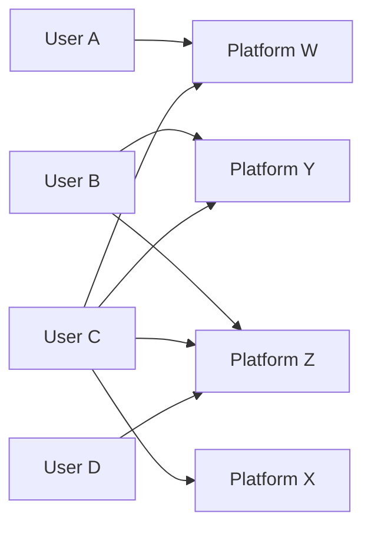
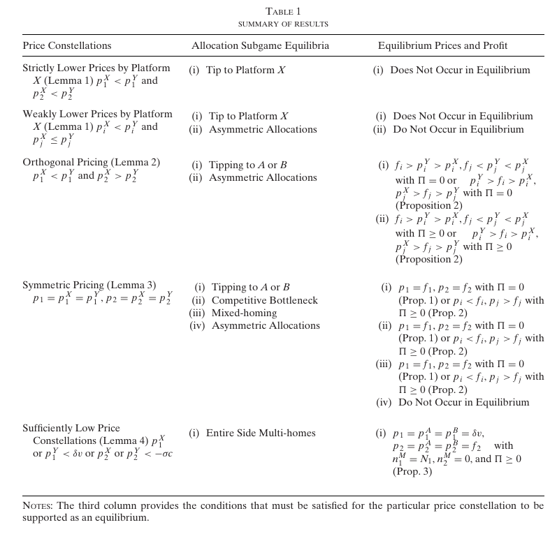

[Thomas D. Jeitschko](https://provost.msu.edu/about-the-office/meet-the-provost), [Mark J. Tremblay](https://sites.google.com/site/markjtremblay/)
tags: #presentation #Oligopoly #platformcompetition #homing

[Link to the Paper](https://doi.org/10.1111/iere.12457)

# Platform
*Platform* is basically an intermediary which facilitates interaction between two or more group of agents. That group can be buyer or seller. 

eg., Amazon, Tinder, OLX, etc

# Homing
Homing simply means the concept of user making a 'home' 
Based on the industry type, there could be multiple platform offering the same service. For example, in e-commerce, we find Flipkart and Amazon delivering the same kind of service to the end user. Based on user choosing how many platforms to avail the services from, we can classify homing as [[Single Homing]] or [[Multi Homing]]. The paper also discusses about the prevalence of mixed-homing configurations  where single-homing and multi-homing exists on each side of the market. e.g., Some user may play video games on x-box and PS5 (resulting in [[Single Homing]]) while some user may only play either from X-box or PS5 (resulting in [[Multi Homing]]), This configuration is termed as mixed-homing configuration in the literature. 

# Bipartite Graph

The structure of [[Single Homing]] and [[Multi Homing]] configurations can be easily explained through application of bipartite graph. 

The overall configuration is mixed-homing configuration.

# Introduction

Most of the literature has taken the bipartite graph as given, that is homing decisions are fixed prior to platforms deciding the price. In this paper, a two sided market is considered in which consumers and firm endogenously determine whether they single-home, multi-home or exit the market. 

The seminal literature have focused on other critical issues of the market, like what are the potential coordination issues on either side of the market. Like [[Caillaud and Jullien (2003)]] says that coordination favours the incumbent platform ; otherwise platforms may fail to gain a critical mass, that is 'fail to launch' and this solves the [[Chicken and Egg]] problem.

[[Hagiu (2006)]] shows that chicken and egg problem does not occur when sides join the platform sequentially. [[Ambrus and Argenziano(2009)]] shows how prices can endogenize heterogeneity and steer agents to asymmetric allocation configurations. [[Karle et al]] consider how the structure of the competition within the firm side of the market determines whether all agents tip to one platform or whether the market is segmented between two platforms. 

When exogenous homing decisions are assumed, allocation-specific pricing decisions occur. Exogenously fixed multi-homers face high prices as platforms do not compete for them(due to the fact that by assumption they join both the platforms), whereas exogenously fixed single-homers (who must be dislodged from a rival before they can be acquired as new customers) face low prices.

***To understand how prices related to equilibrium homing decisions requires a model where platform set prices to endogenous homing decisions made by consumers and firm.***

Consumers and firms observe platform pricing before endogenously deciding whether and how many platforms to join. 

#### Results
- Different allocations of consumers and firms emerge in equilibrium, including mixed-homing allocation, not seen in previous literature.
- Sufficiently low prices induce multi-homing and that certain allocations with multi-homing on one side require that the prices on that side be sufficiently low. The results coincide with previous literature on how lower prices coincide with multi-homing and higher prices coincide with single-homing. 
- Identify the conditions that are required for certain allocations to exist as equilibrium, and they show that industries where a particular allocation occurs match the equilibrium conditions for that allocation. 
- They also show that how two homogeneous platforms might avoid the Bertrand paradox. Undercutting certain prices that earn profit might not be optimal in a two side market.

There are also literature which has considered endogenous homing, [[Armstrong and Wright(2007)]] which extend [[Armstrong (2006)]] and show how the common [["competitive bottleneck" ]]can endogenously arise. This results stem from a model with horizontally differentiated platforms ([[Hotelling Framework]])  in which for high transportation costs all agents single-home, whereas for low transportation costs, all agents multi-home. 

[[Armstrong and Wright(2007)]] generate the same pricing results as [[Armstrong (2006)]] where the side that single-homes faces competitive prices whereas the side that multi-homes faces monopoly pricing by both platforms. These pricing results follow because platforms do not compete over multi-homers but instead compete over single-homers who can switch to the competing platform.  But this results stem from the homing decision being made prior to platform pricing decisions. *The authors find that lower prices drive multi-homing when prices being made prior to homing decisions.*

[[Rochet and Tirole(2003)]] also talks about endogenous homing, where buyers and sellers engage in a matched transaction that takes place on a platform. For illustration- They take the example of credit card market. It is assumed that credit card issuers only charge per transaction and doesn't charge merchants any membership fee, so all agents can costlessly multi-home. However, because card-users can choose which card to use when they make a purchase, merchants may use to single-home in order to limit the customers' options of which card to use. This paper. however, allow for both usage and stand-alone membership benefits, but they consider platforms that compete by setting membership/access fees, as this relates more closely to the markets that we are concerned with. 

[[Belleflame and Peitz(2019)]] considers mixed-homing in the Armstrong Framework. However, their results also coincide with the classic relationship between multi-homing and higher prices. 

## The Model

- Two group of agents on either side of the platforms (Consumers and Firms). 
- Agent on Side 1 are *Consumers* and Agent on Side 2 are called *Firms*.
- The benefits from interaction to an agent in one group depends on the number of agents of the other group.
- The platform charges each agent of the group a price to participate in the platform. 
- The model consider two platforms, $\mathbf{X} \in {\{A,B}\}$ .
- A multi-stage game. Simultaneous and non-cooperative actions.
- First, the platforms set prices to each of the two groups. 
- Thereafter, upon observing the platform prices, agents on each side, simultaneously make participation decisions. 
- Number of consumers that join *platform* $\mathbf{X}$  is ${n_1}^\mathbf{x} \in {[0,\bar{N}_1]}$ and number of firms that join *platform* $\mathbf{X}$ is ${n_2}^\mathbf{x} \in {[0,\bar{N}_2]}$ .
- Cost to the platform of accommodating  an agent on side $i \in {\{1,2}\}$ who joins platform is $f_i \geq 0$ and there are no fixed costs.
- The profit for platform $\mathbf{X}$ is given by, $\prod^{\mathbf{X}}=n_1^{\mathbf{X}} (p_1^{\mathbf{X}}-f_1)+ n_2^{\mathbf{X}} (p_2^{\mathbf{X}}-f_2)$, where $p_i^{\mathbf{X}}$ is the uniform price that platform $\mathbf{X}$ charges to side $i$. 

#### Side 1 - Consumers

- Consumers on side 1 draw their type $\theta_1$ from the distribution $F_1$ on support  $[0,1]$.
- All consumers outside option is valued at 0. 
- Utility of consumer of type $\theta_1$ from single homing on platform $\mathbf{X}$ is given by, $u_i^{\mathbf{X}}(\theta_1) = v+\alpha_1(\theta_1). n_2^{\mathbf{X}}- p_1^{\mathbf{X}}$ and $v \geq 0$ 
- Where $v$ is the membership benefits every consumer receives from joining the platform. The consumer gets it even if no firm joins the platform. $v$ does not depend on consumer type and remains the same regardless of which platform the consumer joins. 
- However, Consumers are heterogeneous in their marginal benefit from firms. 
- The network effect (marginal benefit) to consumer of type $\theta_1$ for an additional firm on the platform is constant and given by $\alpha_1(\theta_1)$ also $\alpha_1(\theta_1) \geq 0$ . 
- $\alpha_1(\theta_1)$ is decreasing in $\theta_1$. That is, consumer whose $\theta_1$(type) is located far from zero have network effects (marginal benefit) higher relative to consumers whose $\theta_1$(type) is close to zero.
- We normalise $F_1$ to be uniform distribution over $[0,1]$ so that mass of type $\theta_1$ is given by $\theta_1. \bar{N}_1$ 
- The number of firms that join the platform $\mathbf{X}$ is $n_2^{\mathbf{X}}$.  
- There are two platforms, $A$ and $B$ , so consumer can join either one or both of them. In case of multi-homing, the utility of consumer is given by: $u_1^{\mathbf{M}}(\theta_1) = (1+\delta)v+\alpha_1(\theta_1).N_2-p_1^{A} - p_1^{B}$ 
- Here, $N_2$ is the aggregate number of firms in Platform A and B. So, $n_2^A$ denotes number of firms joining platform A and $n_2^B$ denotes the number of firms joining platform B. Let $n_2^M$ be the number of firms multi-homing. Then, $N_2=n_1^A+n_2^B - n_2^M$. 
- So having a firm available on both the platforms doesn't provide any extra benefits to the consumer. 
- Also, if a consumer joins two platforms, the intrinsic benefit from the second platform diminishes and hence the stand-alone marginal benefit is just $(1+\delta)v$ , $\delta \in [0,1]$. 

#### Side 2 - Firms 

- Firms on side 2 draw their type $\theta_2$ from the distribution $F_2$ on support $[0,1]$. Similar to side 1, we normalise $F_2$ to be uniform distribution over $[0,1]$, so that mass of type $\theta_2$ firms is given by $\theta_2.\bar{N}_2$ 
- All firm's outside option is 0.
- Firm's payoff from single homing is given by, $u_2^{\mathbf{X}}(\theta_2)=\alpha_2(\theta_2).n_1^\mathbf{X} - c - p_2^\mathbf{X}$.
- Firms are heterogeneous in their marginal benefits from consumers. 
- The network effect(marginal benefit) to a consumer of type $\theta_2$ for an additional consumer on the platform is constant and given by $\alpha_2(\theta_2)$ .
- $\alpha_2(\theta_2)$ is decreasing in type $\theta_2$. That is, firms whose type $\theta_2$ is close to zero have marginal benefits that are high relative to those firms whose type is located far from zero. 
- $p_2^\mathbf{X}$ is the price paid by the firm to platform $\mathbf{X}$.
- Firm incur cost $c>0$ to join the platform. This cost reflects the cost of coding, programming, formatting their product to list in the platform, etc. 
- Firms are homogeneous with respect to their development and synchronisation cost.
- A firm which multi-homes has payoff, $u_2^M(\theta_2)=\alpha_2(\theta_2).N_1-(1+\sigma).c -p_2^A - p_2^B$ 
- Where $N_1= n_1^A+n_1^B-n_1^M$ , $n_1^A$ denotes number of consumer joining platform A, $n_2^B$ denotes number of firm joining platform B and $n_1^A$ denotes the number joining both the platforms. The firm only cares about number of distinct consumers present in the platforms. 
- When a firm multi-homes, that is participate in two platforms, its synchronisation and development cost diminishes to $\sigma c$, with $\sigma \in [0,1]$ 
- Imagine the smartphone brand "Nothing" listing its product on both Amazon and Flipkart, now once a code has been written, with slight modification of the code, the same can be used in Flipkart too.  
- The authors coins the term $\sigma$ representing the amount of "duplication economies" that exists when synchronising an app or game to a second platform.
- If $\sigma=1$, there exists no "duplication economies" and as $\sigma$ decreases, there exists "economies of duplication".

#### Strategies and Equilibrium Concept

The paper focuses exclusively for [[Pure strategies]] and solves for the [[Subgame Perfect Nash Equilibrium]] . The authors exclusively focuses on prices  for which platforms have  not priced themselves out of the market. If the authors would have removed this restriction, the allocation equilibria would require making a distinction between prices in ranges in which agents participate and ranges where agents do not participate, as the latter is dominated in platform pricing game, they are not used in the equilibrium. 

There are strategic complementarities across the two side of the platform(More consumers participate, higher is the profit for firms. More firms participate, higher is the utility for consumers), for any given set of prices chosen by the platform, multiple allocation equilibrium configurations can exist in the allocation sub-game. 

To reduce multiplicity (simplifying or consolidating elements in a system (e.g., a mathematical, computational, or conceptual model) to avoid excessive complexity caused by redundant or overlapping components) of the model, the authors restrict the set of allocation to set of "meaningful" equilibria. They rule out the following equilibria: 
- The no-trade subgame equilibrium where no consumers and no firms join any platform is ruled [[out and off path]], whenever there exists some equilibrium where some firms and consumers participate. 
- Agents beliefs about allocations (after observing prices) are important determinants of equilibria. However, where the observed prices do not impact agent beliefs about allocations, then a price advantage of one platform on both sides of the market need not rule out the allocation where all agents tip to the higher priced alternative platform as an equilibrium. Which basically means that if price is not an important determinant to decide allocation, users (firm or consumers) will join a platform which has higher user base irrespective of the price the platform charges. For example, If 50 sellers are available on Amazon and 20 sellers are Flipkart, if consumer doesn't care about prices charged by the platform, they will join Amazon due to higher seller base. Conversely, if users believe higher price on side $i$ will earn no participation on that side, then price undercutting on both sides always generates a unique equilibrium allocation where users tip to the lower priced platform.  For example, if for Amazon , the buyer side price is high than Flipkart, the sellers would think, no one is going to join Amazon and both will move to the cheaper platform. (Tip means winner takes all).

The authors make the following assumption: **If Platform Y has prices that are strictly better on one side of the platform and no worse on the other ($p_i^Y<p_i^X$ and $p_j^Y \geq p_j^X$ for $j \neq i$ ), then platform $Y$ has $n_k^Y > n_k^X$ for some $n=1,2$.** The authors preclude dis-coordinated allocation configurations in which despite having better (lower) prices, a platform fails to attract more agent than its rival on at least one side of the platform. The assumption says nothing about which side has greater participation. 

#### Equilibrium 

Below is the summary of equilibrium results. We will go one by one into finding the equilibrium.

First, the authors see how the allocation of consumers and firms in joining platform for arbitrary price looks like. And then they determine the pricing equilibria for the entire game by considering price competition between two platforms. 

###### The Allocation Equilibrium for Arbitrary Prices

Define, $s_1=\delta v$ and $s_2=-\sigma c$ , so $s_i$ denotes the threshold utility for joining a second platform when that platform has no participation on other side of the market.

In addition, let $w_1=\delta v + \alpha_1(0).\frac{\bar{N_2}}{2}>s_1$ and $w_2=-\sigma c + \alpha_1(0).\frac{\bar{N_1}}{2}>s_2$ , $w_i$ captures the maximum benefit to a side $i$ agent from joining a second platform when the platforms split participation equally on the other side of the market. 

> **Lemma 1 (Allocations with a Lower Priced Platform):** Suppose that $s_i<p_i^X$ and $p_i^X \leq p_i^X$ for $i=1,2$ with at least one inequality being strict. If $p_i^Y<p_i^X$ for $i=1,2$ or if $p_i^Y<w_i<p_i^X$  and $p_j^Y=p_j^X$ for $i=1,2$ and $j\neq i$, then there exists a unique allocation equilibrium in which all active agents join Platform Y exclusively: $n_i^Y=N_i$ and $n_i^X=0$, for $i=1,2$. '
> If $p_i^Y<p_i^X<w_i$  and $p_j^Y=p_j^X$ for $i=1,2$ and $j \neq i$, then tipping to platform Y is an equilibrium. In addition, there exists equilibrium allocations where all active Side $i$ agents multi-home $(n_i^X=n_i^Y=n_i^M)$ and the side $j$ agents single home so that $n_j^Y>n_j^X$

**Proof:** 
Without loss of generality, Let us assume, $i=1(consumers)$ $\text{and}$ $j=2(firms)$ and $X=Platform(A), Y=Platform(B)$.

Given, ($s_1<p_1^A;s_2 <p_2^A$) & ($p_1^B<p_1^A$ and $p_2^B \leq p_2^A$ ) 

***Case 1:*** 

*Case 1.1*: If ($p_1^B < p_1^A$ and $p_2^B<p_2^A$),  that is prices on both the sides are strictly lesser in Platform B than in Platform A. The equilibrium is- *All active agents join Platform B* 

Given, $p_1^B < p_1^A$ and $p_2^B<p_2^A$, by assumption of dis-coordinated equilibrium, $n_k^B>n_k^A$, where $k=1$  or $2$. Without loss of generality, $n_1^B>n_1^A$. 
So, $u_2^A= \alpha_2(\theta_2).n_1^A - c -p_2^A$ and $u_2^B= \alpha_2(\theta_2).n_1^B - c -p_2^B$ . Clearly $u_2^B>u_2^A$ .So, all firms join platform B: $n_2^B=N_2$ . This with $p_1^B<p_1^A$ implies that $u_1^B(\theta_2)>u_1^A(\theta_2)$. 
$u_1^A(\theta_1)= 1+\alpha_1(\theta_1).n_2^A-p_1^A=1+\alpha_1(\theta_1).0-p_1^A=1+p_1^A$  and $u_1^B(\theta_1)= 1+\alpha_1(\theta_1).n_2^B-p_1^B$. Clearly, $u_1^B>u_1^A$ and $u_1^B>u_1^A$ , hence, all consumers join B. Given this, this is an equilibrium, as no agent has any incentive to deviate. The condition, $s_i<p_i^A$ prevents multi-homing. Because there are no agents on platform A, by deviating to platform B, agent pays higher cost than the benefit they receive. 

==However, I had this question in mind, why $u_2^M(\theta_2)<u_2^Y(\theta_2) \quad \forall \quad \theta_2$. There would be some values of $\theta_2$ and $n_1^X$ for which $u_2^M > u_2^M$.== Got the answer.

Now when $u_2^B>u_2^A$, all firms join Platform B, but there may be some firms who are keen to multi-home. In this case, either, $n_2^B=n_2^M=n_2^X$ or $n_2^B>n_2^M=n_2^X$. There are no distinct firms in Platform A. So if there are no distinct firms in Platform A, there's no additional benefit to the consumers, and they will shift to Platform B. And because there are no consumers in Platform A, and due to the restriction, $s_i<p_i^X$, the firms don't find it profitable to multi-home. 

***Case 2:*** 

If $p_i^B<w_i<p_i^A$ and $p_j^B=p_j^A$ for $i=1,2$ and $j \neq i$ , then there exists a unique equilibrium in which all active agents join platform B. 
Let us have a discussion on $w_i$. As the author has defined it, it is the maximum benefit of joining the second platform when the authors split participation equally on other side of the market. Let us take consumer side to understand it. So, $w_1=\delta v + \alpha_1(0)(\bar N_2/2)$. The benefit to a consumer can be written as : $v+\delta v+\alpha_1(\theta_1)(n_2^A+n_2^B-n_2^M)$ . Now for maximum benefit to the consumer, $\theta_1=0$ and $n_2^M=0$, which results in: $v+\delta v+\alpha_1(0)(n_2^A+n_2^B)=[v+\alpha_1(0)(n_2^A)] +[\delta v+\alpha_1(0)(n_2^B)]$ . If there's equal division of firms between the platforms, then, $n_2^A=n_2^B=\bar{N}_2 /2$ . So the maximum benefit tot he consumers joining the second platform if firms are equally divided is given as: $\delta v+\alpha_1(0)(\bar{N}_2)$ . 

*Case 2.1:* Given, $p_i^Y<w_i<p_i^X$ and $p_i^Y=p_j^X$ , which can be written as: $p_1^B<w_1<p_1^A$ and $p_2^B=p_2^A$
Again by no- dis-coordination assumption, we get, $n_k^B>n_k^A$ and by no loss in generality, we can write, $n_2^B>n_2^A$ .
Now, $u_1^B(\theta_2)=v+\alpha_1(\theta_1)n_2^B-p_1^B$ and $u_1^A(\theta_2)=v+\alpha_1(\theta_1)n_2^A-p_1^A$, Clearly, $u_1^B(\theta_1)>u_1^B(\theta_1)$.
Which means all active customer would join platform B, and there would be no distinct consumers in Platform A. However, there is a possibility that some consumers may multi-home,as described by the explanation in Case 1. Mathematically, there would be two cases, $n_1^B>n_1^M=n_1^A$ or $n_1^B=n_1^M=n_1^A$ 

*Case 2.1.1:* For the case, $n_1^B>n_1^M=n_1^A$, the result would be,  $u_2^B(\theta_2)>u_2^A(\theta_2)$. So, all active firms would join platform B and none would distinctively join platform A. There are no distinct consumers in platform A, the firms would not multi-home. And same for consumers. So, all consumer and firms single homing on platform B, is an unique equilibrium. Similar to Case 1.

*Case 2.1.2:* Now, for the latter case, where, $n_1^B=n_1^M=n_1^A$, here all consumers multi-home. And for this case, $u_2^B(\theta_2)=u_2^A(\theta_2)$. So some may join platform A distinctively, some may join platform B distinctively and no one would multi-home as same set of consumers are available for both the platforms, so joining a second platform is not going to give any extra-benefits. But with the condition, $n_2^B>n_2^A$. Let us now write the utility function for the consumers-
$u_1^A(\theta_1)= v+\alpha_1(\theta_1)n_2^A-p_1^A$ , $u_1^B(\theta_1)= v+\alpha_1(\theta_1)n_2^B-p_1^B$ and $u_1^M(\theta_1)= v+\delta v+\alpha_1(\theta_1)(n_2^B+n_2^A)-p_1^A-p_1^B$ . Clearly, $u_1^A(\theta_1)<u_1^B(\theta_2)$, we need a comparison between $u_1^B(\theta_1)$ and $u_1^M(\theta_1)$. Re-writing $u_1^M(\theta_1)$ as $u_1^M(\theta_1)= [ v+\alpha_1(\theta_1)(n_2^B)-p_1^B]+[\delta v+\alpha_1(\theta_1)(n_2^A)-p_1^A]$ , if the second term turns out to be negative, then we have $u_1^B(\theta_1)>u_1^M(\theta_1)$. Now, this is ensured by the case, $p_1^B<w_1<p_1^A$ and  $w_1>\delta v + \alpha_1(\theta_1)n_2^A$ . So if the highest possible benefit from joining the second platform is less then the price the consumers are paying($w_1-p_1^A<0$), which implies, $\delta v+\alpha_1(\theta_1)(n_2^A)-p_1^A<0$ , which establishes, $u_1^B(\theta_1)>u_1^M(\theta_1)$. That means, all consumers single home at platform B. Thus, $n_1^B>n_1^A$, and we are back to the ==Case 2.1.1==. Ultimately, all consumers and firms single home at Platform B. 

***Case 3:***

If $p_i^B<p_i^A<w_i$ and $p_j^B=p_j^A$ for $i=1,2$ and $j \neq i$ , then tipping to platform B is an equilibrium. In addition, there exists equilibrium where all active side $i$ agents multi-home and side $j$ agents single home so that $n_j^B>n_j^A$. 

Given, $p_i^B<p_i^A<w_i$ and $p_j^B=p_j^A$ for $i=1,2$ and $j \neq i$. We can rewrite this as, $p_1^B<p_1^A<w_1$ and $p_2^B=p_2^A$. By no dis-coordination assumption, we can write, $n_k^B>n_k^A$ and without losing generality, $n_2^B>n_2^A$. 
We can then say, $u_1^B>u_1^A$. So all consumers join platform B and none distinctively joins A. so there are two cases here: $n_1^B > n_1^M=n_1^A$ or $n_1^B = n_1^M=n_1^A$. The former is similar to the case we discussed in Case 2. So we will discuss the later case, $n_1^B = n_1^M=n_1^A$. All consumers multi-home. That is, the same set of consumers are present in Platform A as well as Platform B. After seeing this, the firms, optimally would decide to single home either on Platform A or Platform B with $n_2^B>n_2^A$(mathematically, $u_2^B=u_2^A$ and by no dis-coordination assumption, $n_2^B>n_2^A$). Now consumers see this, and they check whether multi-homing is still optimal. Now if we check the previous calculations in Case 2.1.2, we found that $u_1^M<u_1^B$ for $w_1<p_1^A$, but here we have $w_1>p_1^A$. For this case, either, there are various possibilities, $u_1^M>u_1^B$ for all the users (in this case, we will have a new allocation equilibria, where all consumers multi-home and firms single-home.) or for some consumers, multi-homing is optimal. In this case, $n_1^B>n_1^M=n_1^A$, we fall back to the Case 1. And all consumers and firms will single home on platform B.

This ends Lemma 1. 

If prices are sufficiently low ($p_i^A<w_i$), then platform B must have lower prices on both the sides of the market for the tipping to occur at platform B. Multi-homing becomes attractive option when $\delta v, -\sigma c, \alpha_i$ becomes sufficiently large compared to price. However, if prices are undercut on both sides of the market, joining the lower priced platform is the unique equilibrium allocation. 

> **Lemma 2 (Allocations Under Orthogonal Pricing):** When $p_1^A>p_1^B>s_1$ and $p_2^B>p_2^A>s_2$, there exists as many as three types of equilibria:
>  1. Tipping equilibria in which all active participation takes place on one platform. Tipping to platform B is always an equilibrium. A sufficient condition for tipping to platform A to be an equilibrium is that $p_1^Y>v$.
>  2. There exists an equilibrium in which platform B only attracts multi-homing firms and platform A also attracts single homing firms, $n_2^M=n_2^B<n_2^X$, and high valued consumers single home on platform A, that is, $\theta_1 \in [0,\theta_1^A]$ where $n_1^A.\bar{N}_1$, and low valued consumers single-home on platform B, $\theta \in [\theta_1^A, \theta_1^* ]$ , where $N_1=\theta_1^*.\bar{N}_1$ and $n_1^B=N_1-n_1^A>n_1^A$. This allocation only exists when the consumer price difference is bounded and when the firm price difference is sufficiently large.
>  3. Similarly, for firm prices sufficiently close together, there exists an equilibrium in which platform A only attracts multi-homing consumers whereas Platform B also attracts single homing consumers, $n_1^M=n_1^A<n_1^B$; and high value firms single-home on Platform B, that is $\theta_2 \in [0,\theta_2^B]$, where $n_2^B=\theta_2^B\bar{N}_2$, and low-value firms single-home on Platform A, $\theta_2 \in [\theta_2^B, \theta_2^*]$, where $N_2=\theta_2^*\bar{N}_2$ and $n_2^B=N_2-n_2^B>n_2^B$. This allocation only exists when the firm price difference is bounded and $p_2^B>w_2$. 

Given, $p_1^A>p_1^B>s_1$, higher price charged for consumer by platform A; $p_2^B>p_2^A>s_2$, higher price charged for firms by platform B.

**Case 1:** For tipping to platform B, if all active firm joins platform B, then all active consumers joins platform B and vice versa.
***Case 1.1:*** For tipping to platform B, it must be that if all consumers join platform B, then all Firms must join platform B. 
So, all active consumers joined platform B, that is, consumers doesn't join Platform B distinctively.
$u_2^B(\theta_2)=\alpha_2(\theta_2).n_1^B -c -p_2^B$ , $u_2^A(\theta_2)=\alpha_2(\theta_2).0 -c -p_2^A$, and $u_2^M(\theta_2)=\alpha_2(\theta_2).n_1^B -c-\sigma c -p_2^B-p_2^A$. We can easily conclude that $u_2^B$ is the highest and hence, all active firms tip to platform B. No firm will distinctively join platform A or multi-home and for consumers, it makes no sense to multi-home too.

Now, for Case 1 to hold, we would also need the following to hold.
***Case 1.2:*** For tipping to platform B, it must be that if all firm join platform B, then all active consumers must join platform B. 
The same logic as Case 1.1 applies. 
All active firms tip to platform B, that is, No firm distinctively joins platform A.
$u_1^B(\theta_1)= v+\alpha_1(\theta_1)n_2^B - p_1^B$, $u_1^M(\theta_1)= v+\delta v+\alpha_1(\theta_1)(n_2^B)-p_1^A - p_1^B$, $u_1^A(\theta_1)=v+\alpha_1(\theta_1).0 -p_1^A$. Clearly, $u_1^B(\theta_1)$ gives the highest utility.
So case 2.2 holds true.
So, for the given set of prices, to tip to platform B, the following condition holds true: if all active firms join platform B, then all consumers join platform B and vice versa.

***Case 2:*** For tipping to platform A, if all firms exclusively join platform A, then all consumers exclusively join platform A and vice versa. 
***Case 2.1:*** For tipping to platform A, if all consumers exclusively join platform A, then all firms exclusively join platform A. 
$u_2^A(\theta_2)= \alpha_2(\theta_2).n_1^A-c-p_1^A$, $u_2^B(\theta_2)= \alpha_2(\theta_2).0-c-p_1^B$ and $u_2^M(\theta_2)= \alpha_2(\theta_2).n_1^A-c-\sigma c-p_1^A-p_1^B$. Clearly, $u_2^A(\theta_1$) gives the highest utility. So, all firms tip exclusively to Platform A.

For Case 2 to hold, we also need the following to hold.
***Case 2.2:*** For tipping to platform A, if all firms exclusively join platform A, then all firms exclusively join platform A.
$u_1^A(\theta_1)= v+\alpha_1(\theta_1).n_2^A -p_1^A$, $u_1^B(\theta_1)= v+\alpha_1(\theta_1).0 -p_1^B$ and $u_1^M(\theta_1)= v+\delta v +\alpha_1(\theta_1).n_2^A -p_1^A-p_1^B$ . $u_1^A(\theta_1) is the highest if $p_1^B > v$ otherwise, if $p_1^B<v$ , then $p_1^A \leq p_1^B + \alpha_1(1).n_2^A$. Cause if the condition is true for consumer type $\theta_1=1$, then it is true for any type of consumer. 
So Case 2.2 and Case 2 hold true, if $p_1^B>v$ , or if $p_1^B<v$ then $p_1^A \leq p_1^Y+\alpha_1(1)n_2^A$. And then tipping to platform A is an allocation equilibria. 

This ends Lemma 2.1

***Case 3:*** Given, $p_1^A>p_1^B>s_1$ and $p_2^B>p_2^A>s_2$. We can characterise the following allocation: 
So the marginal consumer who's indifferent between Platform X and Platform Y is given by: 
$u_1^X(\theta^X)=v+\alpha_1(\theta_1^X)n_2^X -p_1^X=v+\alpha_1(\theta_1^X)n_2^Y -p_1^Y=u_1^Y(\theta_1^X)$ . For the above to hold, certainly, the $n_2^X>n_2^Y$.For some $\theta_1^x, u_1^X(\theta_1^X)=u_1^Y(\theta_1^X)$. To the left of $\theta_1^X, u_1^Y(\theta_1^X)>u_1^X(\theta_1^X)$. To the right of $\theta_1^X, u_1^Y(\theta_1^X)<u_1^X(\theta_1^X)$. And $\theta_1^X.\bar{N}_1=n_1^X$ 

Now arranging the types in ascending order, as $\theta_1$ increases, $\alpha_1(\theta_1)$ falls. Thus, the last consumer who would be joining the platform would join platform Y and type $\theta_1^*$ would be given by: $u_1^Y(\theta_1^*)=v+\alpha_1(\theta_1^*)-p_1^Y=0$. And, $\theta_1^*.\bar{N}_1=N_1$. So, $n_1^Y=N_1-n_1^X$.

This can be seen in the figure: 

Now coming to firm side, we have an allocation where all active firms join Platform X and while some multi-home but none distinctively join Platform Y. 
I checked for $u_2^X(\theta_2)>u_2^Y(\theta_2)$, I found for this to happen, $n_1^X>n_1^Y$, but in the paper, the contrary is given. But now, let us assume by brute force, every firm joins platform X. And the last firm to do so is given by: $u_2^X(\theta_2)=\alpha_2(\theta_2)n_1^X-c-p_2^X=0 \implies  \alpha_2(\theta_2)n_1^X=c+p_2^X \implies \theta_2=\alpha_2^{-1}(\frac{c+p_2^X}{n_1^X})\implies n_2^X=\alpha_2^{-1}(\frac{c+p_2^X}{n_1^X})$ 
$n_2^X=\theta_2.\bar{N}_2$. From here, we also get $p_2^X=\alpha_2(\theta_2)n_1^X -c$. 
For multi-homing, $u_2^M(\theta_2)=\alpha_2(\theta_2)(n_1^X + n_1^Y)- \sigma -c\sigma - p_2^Y -p_2^X \implies \alpha_2(\theta_2)(n_1^Y)=p_2^Y + \sigma c \implies \alpha_2(\theta_2)= \frac{p_2^Y+\sigma c}{n_1^Y}, \theta_2=\alpha_2^{-1}(\frac{p_2^Y+\sigma c}{n_1^Y})$
Thus, $n_2^Y=n_2^M=\alpha_2^{-1}(\frac{p_2^Y+\sigma c}{n_1^Y})$ .

Now for this allocation to be equilibrium, it must be: (a) $n_2^X>n_2^Y$ and (b) $n_1^Y>n_1^X$. 
Let's first discuss on (b) $n_1^Y>n_1^X$ 
Now we go back to the the situation when consumer of type $\theta_1^X$ was indifferent between Platform X and Platform Y. Let us write the equation again, $u_1^X(\theta^X)=v+\alpha_1(\theta_1^X)n_2^X -p_1^X=v+\alpha_1(\theta_1^X)n_2^Y -p_1^Y=u_1^Y(\theta_1^X)$. Here, it is given that, $p_1^X>p_1^Y$. So that for equality, we need, $n_2^X>n_2^Y$. Now, we can see, a lower $\theta_1^X$ gives high $\alpha_1(\theta_1^X)$, which means, it will increase the value of $n_2^X.p_1^X$, which means, a lower $n_1^X$ is good to occur if a consumer of type $\theta_1^X$ has to be indifferent between Platform A and Platform B. 
$n_1^X>n_1^Y \implies n_1^X>N_1-n_1^X \implies n_1^X>N_1/2 \implies \theta_1^X.\bar{N}_1>\theta_1^z.\bar{N}_1/2 \implies \theta_1^X>\theta_1^z/2 \implies \theta_1^X>\bar{\theta_1}$ 
So for (b) to hold, the above condition must hold. 
Coming to condition (a), $n_2^X>n_2^Y$ , we found, $n_2^X=\alpha_2^{-1}(\frac{p_2^X+c}{n_1^X}).\bar{N}_2$ and $n_2^Y=\alpha_2^{-1}(\frac{p_2^Y+\sigma c}{n_1^Y}).\bar{N}_2$. So, for condition (a) to hold, $\alpha_2^{-1}(\frac{p_2^X+c}{n_1^X}).\bar{N}_2>\alpha_2^{-1}(\frac{p_2^Y+\sigma c}{n_1^Y}).\bar{N}_2 \implies \alpha_2^{-1}(\frac{p_2^X+c}{n_1^X})>\alpha_2^{-1}(\frac{p_2^Y+\sigma c}{n_1^Y})$. Now, since $\alpha(.)$ is decreasing, for this to hold, $(\frac{p_2^Y+\sigma c}{n_1^Y})>(\frac{p_2^X+c}{n_1^X}) \iff \frac{p_2^Y+\sigma c}{p_2^X+ c}>\frac{n_1^Y}{n_1^X}$  . From (a), we have, $n_1^X>n_1^Y \iff \frac{n_1^X}{n_1^Y}>1$. Thus, we can say: $p_2^Y+\sigma c>p_2^X+c \implies p_2^Y-p_2^X>(1-\sigma)c$. This provides the lower bound on the firm price difference. 

In addition, $n_1^Y=N_1-n_1^X$, and we got, $\frac{p_2Y+\sigma c}{p_2^X+c}>\frac{n_1^Y}{n_1^X} \implies \frac{p_2^X+c}{p_2^Y+\sigma c}<\frac{\theta_1^X}{\theta_1^z-\theta_1^X} \implies \frac{p_2Y+\sigma c}{p_2^X+c}>\frac{\theta_1^z-\theta_1^X}{\theta_1^X} \implies \frac{p_2Y+\sigma c}{p_2^X+c}>\frac{\theta^z}{\theta_1^X}-1 \implies \frac{p_2^Y+\delta c +p_2^X + c}{p_2^X+c}>\frac{\theta_1^z}{\theta_1^X}$
$\implies \theta_1^X>\frac{\theta_1^z(p_2^X+c)}{p_2^Y+\sigma c+p_2^X+c} \implies \theta_1^X>\underline{\theta_1}$ . 

(a) and (b) holds when $p_2^Y-p_2^X>(1-\sigma )c$ and $\theta_1^X \in [\underline{\theta_1}, \bar{\theta_1}]$ . 

So, we have $\theta_1^X \in (\underline{\theta_1}, \bar{\theta_1} \iff (p_1^X-p_1^Y \in (\alpha(\bar{\theta_1}).n_2^X-n_2^Y),\alpha_1(\underline{\theta_1}).(n_2^X-n_2^Y))$ , which gives the bounds on the consumer preferences. 
Also, we need to show that no single-homing consumer wants to multi-home. This follows from, $p_1^X, p_1^Y>s_1$ and $p_2^X, p_2^Y>s_2$ and $n_2^X=N_2 \implies u_1^X(\theta_1)>u_1^M(\theta_1) \forall \theta_1 \in [0,1]$ .

***Case 4:*** It follows the same proof pattern., just replace sellers with customers and vice versa. 