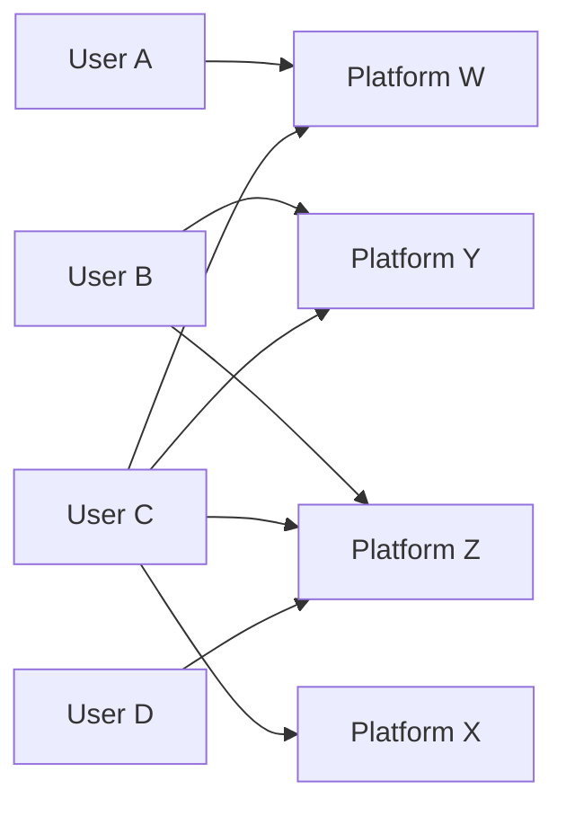

tags: #presentation #Oligopoly #platformcompetition #homing

### Platform
*Platform* is basically an intermediary which facilitates interaction between two or more group of agents. That group can be buyer or seller. 

eg., Amazon, Tinder, OLX, etc

## Homing
Homing simply means the concept of user making a 'home' 
Based on the industry type, there could be multiple platform offering the same service. Fro example, in e-commerce, we find Flipkart and Amazon delivering the same kind of service to the end user. Based on user choosing how many platforms to avail the services from, we can classify homing as [[Single Homing]] or [[Multi Homing]]. The paper also discusses about the prevalence of mixed-homing configurations  where single-homing and multi-homing exists on each side of the market. e.g., Some user may play video games on x-box and PS5 (resulting in [[Single Homing]]) while some user may only play either from X-box or PS5 (resulting in [[Multi Homing]]), This configuration is termed as mixed-homing configuration in the literature. 

## Bipartite Graph

The structure of [[Single Homing]] and [[Multi Homing]] configurations can be easily explained through application of bipartite graph. 

The overall configuration is mixed-homing configuration.

# Introduction

Most of the literature has taken the bipartite graph as given, that is homing decisions are fixed prior to platforms deciding the price. In this paper, a two sided market is considered in which consumers and firm endogenously determine whether they single-home, multi-home or exit the market. 

