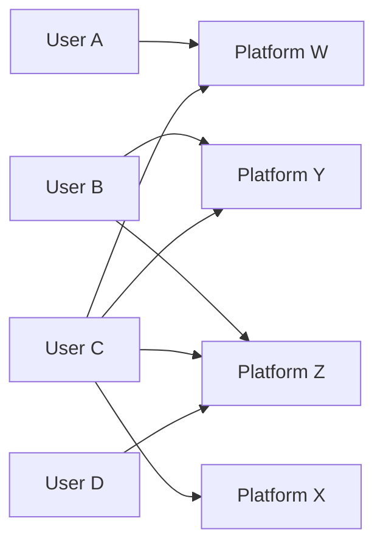

[Thomas D. Jeitschko](https://provost.msu.edu/about-the-office/meet-the-provost), [Mark J. Tremblay](https://sites.google.com/site/markjtremblay/)
tags: #presentation #Oligopoly #platformcompetition #homing

[Link to the Paper](https://doi.org/10.1111/iere.12457)

# Platform
*Platform* is basically an intermediary which facilitates interaction between two or more group of agents. That group can be buyer or seller. 

eg., Amazon, Tinder, OLX, etc

# Homing
Homing simply means the concept of user making a 'home' 
Based on the industry type, there could be multiple platform offering the same service. For example, in e-commerce, we find Flipkart and Amazon delivering the same kind of service to the end user. Based on user choosing how many platforms to avail the services from, we can classify homing as [[Single Homing]] or [[Multi Homing]]. The paper also discusses about the prevalence of mixed-homing configurations  where single-homing and multi-homing exists on each side of the market. e.g., Some user may play video games on x-box and PS5 (resulting in [[Single Homing]]) while some user may only play either from X-box or PS5 (resulting in [[Multi Homing]]), This configuration is termed as mixed-homing configuration in the literature. 

# Bipartite Graph

The structure of [[Single Homing]] and [[Multi Homing]] configurations can be easily explained through application of bipartite graph. 

The overall configuration is mixed-homing configuration.

# Introduction

Most of the literature has taken the bipartite graph as given, that is homing decisions are fixed prior to platforms deciding the price. In this paper, a two sided market is considered in which consumers and firm endogenously determine whether they single-home, multi-home or exit the market. 

The seminal literature have focused on other critical issues of the market, like what are the potential coordination issues on either side of the market. Like [[Caillaud and Jullien (2003)]] says that coordination favours the incumbent platform ; otherwise platforms may fail to gain a critical mass, that is 'fail to launch' and this solves the [[Chicken and Egg]] problem.

[[Hagiu (2006)]] shows that chicken and egg problem does not occur when sides join the platform sequentially. [[Ambrus and Argenziano(2009)]] shows how prices can endogenize heterogeneity and steer agents to asymmetric allocation configurations. [[Karle et al]] consider how the structure of the competition within the firm side of the market determines whether all agents tip to one platform or whether the market is segmented between two platforms. 

When exogenous homing decisions are assumed, allocation-specific pricing decisions occur. Exogenously fixed multi-homers face high prices as platforms do not compete for them(due to the fact that by assumption they join both the platforms), whereas endogenously fixed single-homers (who must be dislodged from a rival before they can be acquired as new customers) face low prices)

***To understand how prices related to equilibrium homing decisions requires a model where platform set prices to endogenous homing decisions made by consumers and firm.***

Consumers and firms observe platform pricing before endogenously deciding whether and how many platforms to join. 

#### Results
- Different allocations of consumers and firms emerge in equilibrium, including mixed-homing allocation, not seen in previous literature.
- Sufficiently low prices induce multi-homing and that certain allocations with multi-homing on one side require that the prices on that side be sufficiently low. The results coincide with previous literature on how lower prices coincide with multi-homing and higher prices coincide with single-homing. 
- Identify the conditions that are required for certain allocations to exist as equilibrium, and they show that industries where a particular allocation occurs match the equilibrium conditions for that allocation. 
- They also show that how two homogeneous platforms might avoid the Bertrand paradox. Undercutting certain prices that earn profit might not be optimal in a two side market.

There are also literature which has considered endogenous homing, [[Armstrong and Wright(2007)]] which extend [[Armstrong (2006)]] and show how the common [["competitive bottleneck" ]]can endogenously arise. This results stem from a model with horizontally differentiated platforms ([[Hotelling Framework]])  in which for high transportation costs all agents single-home, whereas for low transportation costs, all agents multi-home. 

[[Armstrong and Wright(2007)]] generate the same pricing results as [[Armstrong (2006)]] where the side that single-homes faces competitive prices whereas the side that multi-homes faces monopoly pricing by both platforms. These pricing results follow because platforms do not compete over multi-homers but instead compete over single-homers who can switch to the competing platform.  But this results stem from the homing decision being made prior to platform pricing decisions. *The authors find that lower prices drive multi-homing when prices being made prior to homing decisions.*

[[Rochet and Tirole(2003)]] also talks about endogenous homing, where buyers and sellers engage in a matched transaction that takes place on a platform. For illustration- They take the example of credit card market. It is assumed that credit card issuers only charge per transaction and doesn't charge merchants any membership fee, so all agents can costlessly multi-home. However, because card-users can choose which card to use when they make a purchase, merchants may use to single-home in order to limit the customers' options of which card to use. This paper. however, allow for both usage and stand-alone membership benefits, but they consider platforms that compete by setting membership/access fees, as this relates more closely to the markets that we are concerned with. 

[[Belleflame and Peitz(2019)]] considers mixed-homing in the Armstrong Framework. However, their results also coincide with the classic relationship between multi-homing and higher prices. 

## The Model

- Two group of agents on either side of the platforms (Consumers and Firms). 
- Agent on Side 1 are *Consumers* and Agent on Side 2 are called *Firms*.
- The benefits from interaction to an agent in one group depends on the number of agents of the other group.
- The platform charges each agent of the group a price to participate in the platform. 
- The model consider two platforms, $\mathbf{X} \in {\{A,B}\}$ .
- A multi-stage game. Simultaneous and non-cooperative actions.
- First, the platforms set prices to each of the two groups. 
- Thereafter, upon observing the platform prices, agents on each side, simultaneously make participation decisions. 
- Number of consumers that join *platform* $\mathbf{X}$  is ${n_1}^\mathbf{x} \in {[0,\bar{N}_1]}$ and number of firms that join *platform* $\mathbf{X}$ is ${n_2}^\mathbf{x} \in {[0,\bar{N}_2]}$ .
- Cost to the platform of accommodating  an agent on side $i \in {\{1,2}\}$ who joins platform is $f_i \geq 0$ and there are no fixed costs.
- The profit for platform $\mathbf{X}$ is given by, $\prod^{\mathbf{X}}=n_1^{\mathbf{X}} (p_1^{\mathbf{X}}-f_1)+ n_2^{\mathbf{X}} (p_2^{\mathbf{X}}-f_2)$, where $p_i^{\mathbf{X}}$ is the uniform price that platform $\mathbf{X}$ charges to side $i$. 

#### Side 1 - Consumers

- Consumers on side 1 draw their type $\theta_1$ from the distribution $F_1$ on support  $[0,1]$.
- All consumers outside option is valued at 0. 
- Utility of consumer of type $\theta_1$ from single homing on platform $\mathbf{X}$ is given by, $u_i^{\mathbf{X}}(\theta_1) = v+\alpha_1(\theta_1). n_2^{\mathbf{X}}- p_1^{\mathbf{X}}$ and $v \geq 0$ 
- Where $v$ is the membership benefits every consumer receives from joining the platform. The consumer gets it even if no firm joins the platform. $v$ does not depend on consumer type and remains the same regardless of which platform the consumer joins. 
- However, Consumers are heterogeneous in their marginal benefit from firms. 
- The network effect (marginal benefit) to consumer of type $\theta_1$ for an additional firm on the platform is constant and given by $\alpha_1(\theta_1)$ also $\alpha_1(\theta_1) \geq 0$ . 
- $\alpha_1(\theta_1)$ is decreasing in $\theta_1$. That is, consumer whose $\theta_1$(type) is located far from zero have network effects (marginal benefit) higher relative to consumers whose $\theta_1$(type) is close to zero.
- We normalise $F_1$ to be uniform distribution over $[0,1]$ so that mass of type $\theta_1$ is given by $\theta_1. \bar{N}_1$ 
- The number of firms that join the platform $\mathbf{X}$ is $n_2^{\mathbf{X}}$.  
- There are two platforms, $A$ and $B$ , so consumer can join either one or both of them. In case of multi-homing, the utility of consumer is given by: $u_1^{\mathbf{M}}(\theta_1) = (1+\delta)v+\alpha_1(\theta_1).N_2-p_1^{A} - p_1^{B}$ 
- Here, $N_2$ is the aggregate number of firms in Platform A and B. So, $n_2^A$ denotes number of firms joining platform A and $n_2^B$ denotes the number of firms joining platform B. Let $n_2^M$ be the number of firms multi-homing. Then, $N_2=n_1^A+n_2^B - n_2^M$. 
- So having a firm available on both the platforms doesn't provide any extra benefits to the consumer. 
- Also, if a consumer joins two platforms, the intrinsic benefit from the second platform diminishes and hence the stand-alone marginal benefit is just $(1+\delta)v$ , $\delta \in [0,1]$. 

