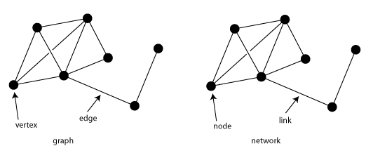

**Network:** Network is a collection of points(nodes) joined by lines(edges).
A **Network** can be also termed as graph. A graph **G=G(V, E)** consists of non-empty set of vertices or nodes **V** and a set of edges **E**. --
- **Vertices(Nodes) V:** A set of points (objects). e.g., people, firms, etc.
- **Edges:** A set of pair of vertices which has connection or link between them, usually denoted by a line. 

